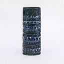
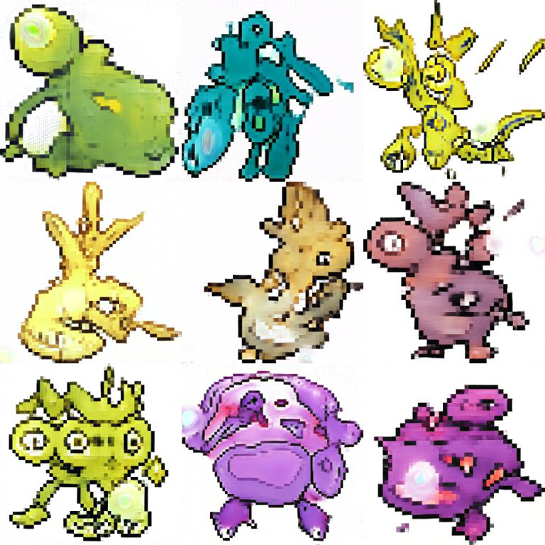
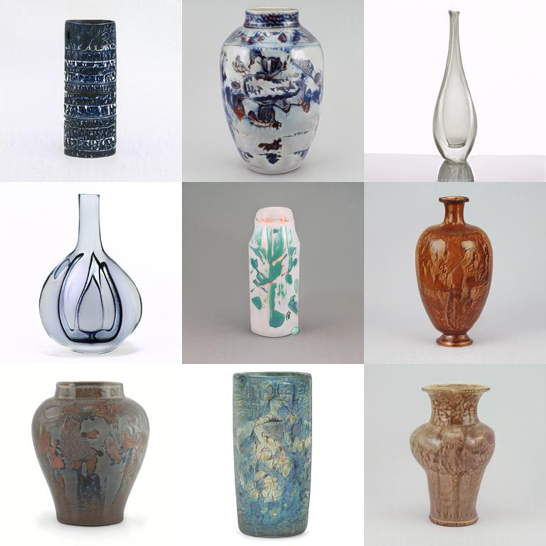
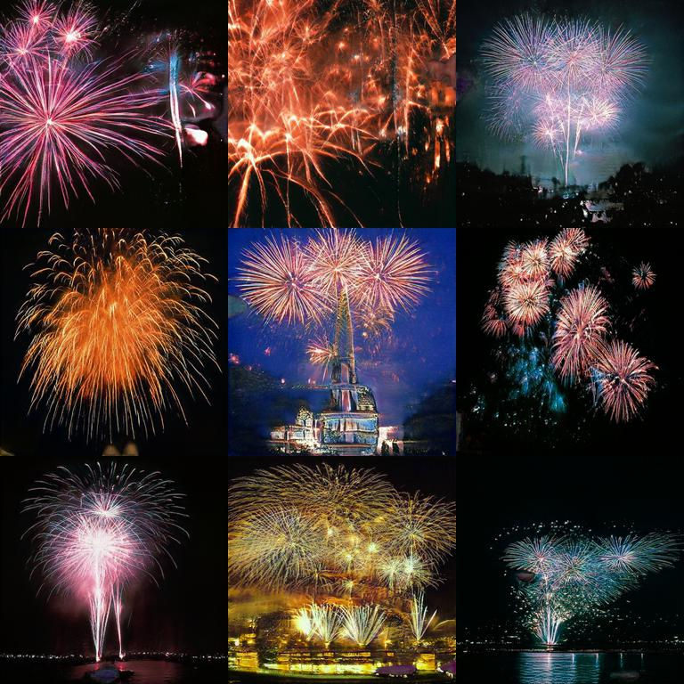

# Awesome Pretrained StyleGAN

A collection of pre-trained [StyleGAN](https://github.com/NVlabs/stylegan) models trained on different datasets at different resolution.

If you have a publically accessible model which you know of, or would like to share please see the [contributing](#contributing) section.

### Table of Contents

- [LSUN Bedrooms](#LSUN-Bedrooms)
- [LSUN Cars](#LSUN-Cars)
- [LSUN Cats](#LSUN-Cats)
- [CelebA HQ Faces](#CelebA-HQ-Faces)
- [FFHQ Faces](#FFHQ-Faces)
- [Pokemon](#Pokemon)
- [Anime Faces](#Anime-Faces)
- [Anime Portraits](#Anime-Portraits)
- [WikiArt Faces](#WikiArt-Faces)
- [Abstract Photos](#Abstract-Photos)
- [Vases](#Vases)
- [Fireworks](#Fireworks)
- [Ukiyo-e Faces](#Ukiyo-e-Faces)

## LSUN Bedrooms

- Dataset: LSUN bedrooms
- Resolution: 256x256
- Author: [karras](https://research.nvidia.com/person/tero-karras)
- [Download link](https://drive.google.com/uc?id=1MOSKeGF0FJcivpBI7s63V9YHloUTORiF)
- Licence: https://github.com/NVlabs/stylegan/blob/master/LICENSE.txt
- [Source](https://github.com/NVlabs/stylegan)

## LSUN Cars

- Dataset: LSUN cars
- Resolution: 512x384
- Author: [karras](https://research.nvidia.com/person/tero-karras)
- [Download link](https://drive.google.com/uc?id=1MJ6iCfNtMIRicihwRorsM3b7mmtmK9c3)
- Licence: https://github.com/NVlabs/stylegan/blob/master/LICENSE.txt
- [Source](https://github.com/NVlabs/stylegan)

## LSUN Cats

- Dataset: LSUN cats
- Resolution: 256x256
- Author: [karras](https://research.nvidia.com/person/tero-karras)
- [Download link](https://drive.google.com/uc?id=1MQywl0FNt6lHu8E_EUqnRbviagS7fbiJ)
- Licence: https://github.com/NVlabs/stylegan/blob/master/LICENSE.txt
- [Source](https://github.com/NVlabs/stylegan)

## CelebA HQ Faces

- Dataset: CelebAHQ
- Resolution: 1024x1024
- Author: [karras](https://research.nvidia.com/person/tero-karras)
- [Download link](https://drive.google.com/uc?id=1MGqJl28pN4t7SAtSrPdSRJSQJqahkzUf)
- Licence: https://github.com/NVlabs/stylegan/blob/master/LICENSE.txt
- [Source](https://github.com/NVlabs/stylegan)

## FFHQ Faces

- Dataset: FFHQ
- Resolution: 1024x1024
- Author: [karras](https://research.nvidia.com/person/tero-karras)
- [Download link](https://drive.google.com/uc?id=1MEGjdvVpUsu1jB4zrXZN7Y4kBBOzizDQ)
- Licence: https://github.com/NVlabs/stylegan/blob/master/LICENSE.txt
- [Source](https://github.com/NVlabs/stylegan)

## Pokemon

- Dataset: Unknown
- Resolution: 
- Author: [Michael Friesen](https://twitter.com/michaelfriese10)
- [Download link](https://www.dropbox.com/s/a7oiegcixl7mye7/pokemon.pkl?dl=1)
- Licence: Unknown
- [Source](https://twitter.com/MichaelFriese10/status/1127614400750346240)

## Anime Faces

- Dataset: Danbooru2017
- Resolution: 512x512
- Author: [gwern](https://www.gwern.net/)
- [Download link](https://mega.nz/#!vawjXISI!F7s13yRicxDA3QYqYDL2kjnc2K7Zk3DwCIYETREmBP4)
- Licence: Unknown
- [Source](https://www.gwern.net/Faces#models)

## Anime Portraits

- Dataset: Danbooru2017
- Resolution: 512x512
- Author: [gwern](https://www.gwern.net/)
- [Download link](https://mega.nz/#!CRtiDI7S!xo4zm3n7pkq1Lsfmuio1O8QPpUwHrtFTHjNJ8_XxSJs)
- Licence: Unknown
- [Source](https://www.gwern.net/Faces#portrait-results)

## WikiArt Faces

- Dataset: WikiArt
- Resolution: 
- Author: [ak9250](https://github.com/ak9250)
- [Download link](https://drive.google.com/uc?id=1cJQtMeTy_QldOP7n64F8stCDXY6Esup9)
- Licence: https://github.com/ak9250/stylegan-art/blob/master/LICENSE.txt
- [Source](https://github.com/ak9250/stylegan-art)

## Abstract Photos

- Dataset: 1-2-3 Abstract Photography Flickr Group
- Resolution: 512x512
- Author: [Michael Friesen](https://twitter.com/michaelfriese10)
- [Download link](https://mega.nz/#!vCQyHQZT!zdeOg3VvT4922Z2UfxO51xgAfJD-NAK2nW7H_jMlilU)
- Licence: Unknown
- [Source](https://twitter.com/MichaelFriese10/status/1151683347065610240)

## Vases

- Dataset: Museum photos
- Resolution: 1024x1024
- Author: [Derek Philip Au](http://derekau.net/)
- [Download link](https://thisvesseldoesnotexist.s3-us-west-2.amazonaws.com/public/network-snapshot-008980.pkl)
- Licence: Unknown
- [Source](https://thisvesseldoesnotexist.com/#/)

## Fireworks

- Dataset: Unknown
- Resolution: 
- Author: [Jonathan Fly](https://twitter.com/jonathanfly)
- [Download link](https://mega.nz/#!7uBHnACY!quIW-pjdDa7NqnZOYh1z5UemWwPOW6HkYSoJ4usCg9U)
- Licence: Unknown
- [Source](https://twitter.com/jonathanfly/status/1148000690586959872)

## Ukiyo-e Faces

- Dataset: Museum photos
- Resolution: 512x512
- Author: [Justin Pinkney](https://twitter.com/Buntworthy)
- [Download link](https://drive.google.com/uc?id=1CHbJlci9NhVFifNQb3vCGu6zw4eqzvTd)
- Licence: Unknown
- [Source](https://twitter.com/Buntworthy/status/1213573469893545984)

## Contributing

This readme is automatically generated using Jinja, please do not try and edit it directly. Information about the models is stored in `models.csv` please add your model to this file. Preview images are generated automatically and the process is used to test the link so please only edit the csv file.